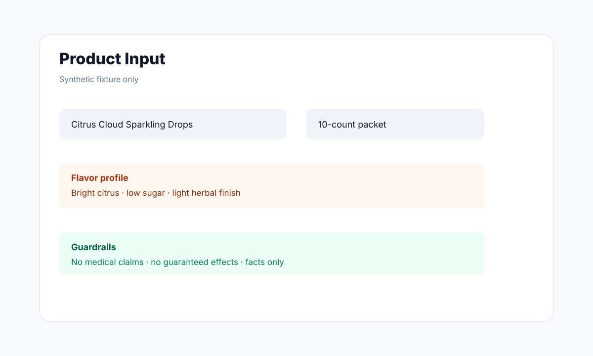
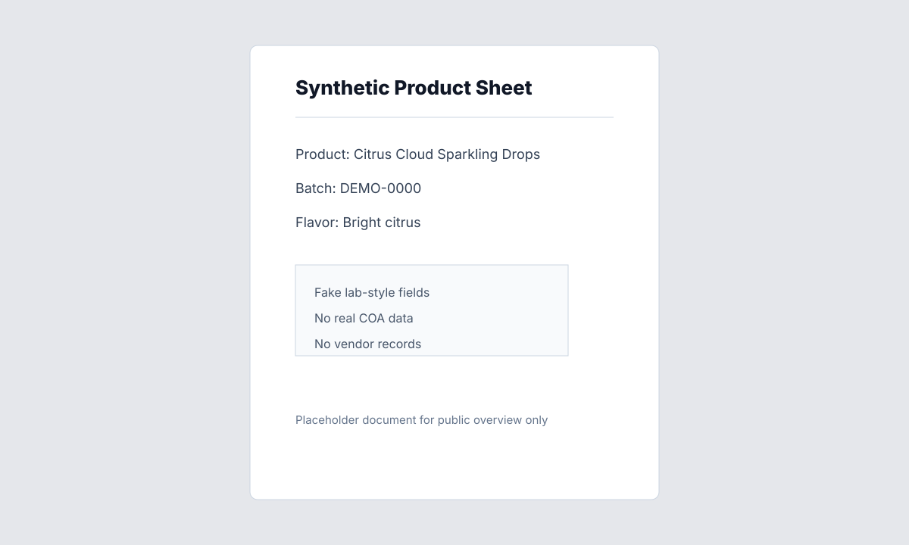

# Product Description Generator Public Overview

This is a redacted public overview of a structured product-description generation workflow. It describes the architecture and safety boundaries using synthetic product and lab-style inputs only.

## Product Problem

Teams need consistent product descriptions from structured product inputs, lab-style documents, and brand voice constraints. Manual drafting is slow, inconsistent, and easy to misalign with compliance or channel requirements.

## What The System Does

- Accepts structured product attributes and uploaded reference documents.
- Extracts or maps relevant product details into a normalized input model.
- Generates draft descriptions for multiple channels or tones.
- Allows review and editing before final use.
- Keeps source inputs, generated drafts, and final copy separated.

## Architecture Notes

- Upload/input flow for product references.
- Parsing and normalization layer.
- Prompt construction with product facts, tone rules, and prohibited claims.
- AI generation service.
- Review UI for editing, approval, and export.

## Data And Privacy Boundary

Public materials should use fake product names, fake lab values, fake brands, and synthetic documents.

Do not publish:

- Real COAs or product documents.
- Real product SKUs, batch IDs, pricing, inventory, or vendor records.
- Brand-specific compliance language unless approved.
- API keys or deployed service config.

## Public Materials

- [Architecture diagram](docs/ARCHITECTURE.md)
- [Synthetic product input example](docs/SYNTHETIC_INPUT.md)
- [Synthetic document fixture](docs/SYNTHETIC_INPUT.md#synthetic-document-fixture)
- [Example draft/final copy pair](docs/DRAFT_AND_FINAL_COPY.md)
- [Prohibited claims, human review, and prompt guardrails](docs/GUARDRAILS.md)

## Synthetic Visuals

These examples use fake products, fake lab-style values, and placeholder document content.

## Suggested Public Copy

> A redacted technical overview of a product-copy workflow that turns structured product inputs into reviewable AI-assisted descriptions.
