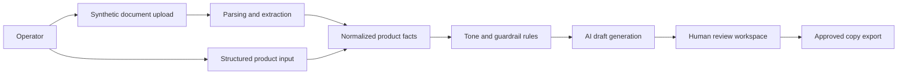

# Architecture Diagram

## Public Boundary

- Source inputs and generated drafts are separate.
- Product facts come from structured inputs, not model guesses.
- The AI service drafts copy, but the review step decides what is approved.
- Public examples use synthetic products and synthetic lab-style documents only.

