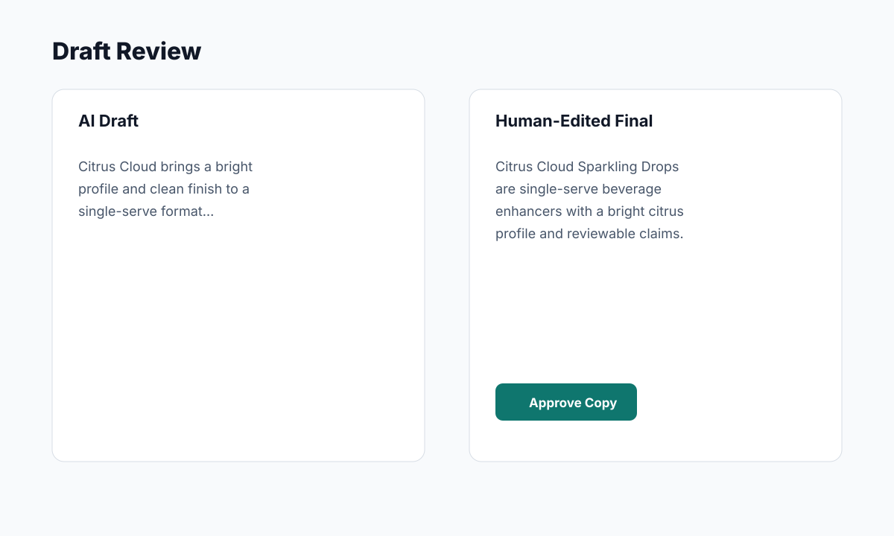

# Example Draft And Final Copy Pair

## Normalized Facts

| Field | Synthetic Value |
|---|---|
| Product | Citrus Cloud Sparkling Drops |
| Format | 10-count single-serve packet |
| Flavor | Bright citrus, light herbal finish |
| Channel | Web description |
| Tone | Clear, premium, grounded |

## AI Draft

> Citrus Cloud Sparkling Drops bring a bright citrus profile and clean finish to a convenient single-serve format. Designed for easy mixing, each packet supports a consistent product experience with a light, refreshing character.

## Human-Edited Final

> Citrus Cloud Sparkling Drops are single-serve beverage enhancers with a bright citrus profile, low-sugar format, and a light herbal finish. Built for simple mixing and consistent serving, they give teams a clear, polished way to describe the product across menu, web, and sales materials.

## Review Notes

- Removed vague sensory claims.
- Kept facts tied to structured input.
- Avoided unsupported compliance or effect language.
- Preserved a consistent tone across sales and web usage.

